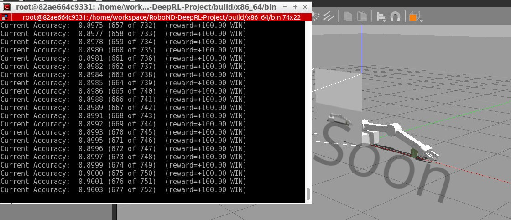
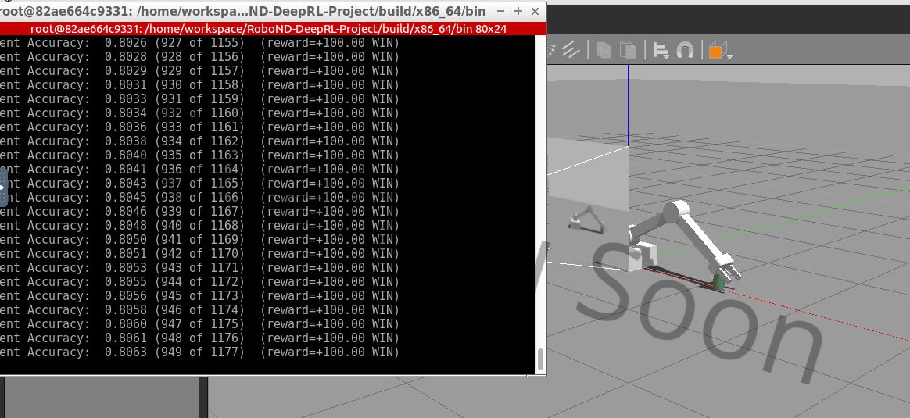

# Udacity Student Project: Deep Reinforcement Learning Arm Manipulation
A Udacity student project to create a DQN agent and define reward functions to teach a robotic arm to carry out two primary objectives:
- Have any part of the robot arm touch the object of interest, with at least a 90% accuracy.
- Have only the gripper base of the robot arm touch the object, with at least a 80% accuracy.

In this project, students will learn the following:
- Create a DQN agent for a robotic arm in gazebo.
- Define reward functions and tune the hyperparameters for RL agent to train the robot arm to perform specific tasks.

Full report can refer to [here](DeepRLArmManipulation.pdf).

## Run the Project
After completing the project, you can launch it by running the following commands
```bash
$ cd /home/workspace/RoboND-DeepRL-Project/build
$ make
$ cd x86_64/bin
$ ./gazebo-arm.sh
```

## Objective 1's Result


## Objective 2's Result

